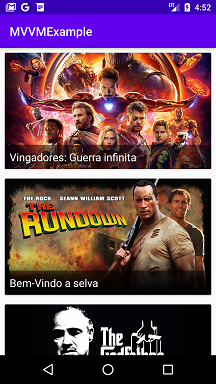

# MVVM Example
Projeto desenvolvido no curso "Princípios do desenvolvimento Kotlin com Clean Architecture e MVVM" do bootcamp everis Kotlin Developer da [Digital Innovation One](https://digitalinnovation.one).

Este aplicativo foi desenvolvido seguindo as regras da arquitetura MVVM (*Model View ViewModel*). É um aplicativo simples que constrói uma lista de filmes com base em dados obtidos por meio de uma API.

## Instruções
Faça o clone ou download do repositório e execute o aplicativo no Android Studio.

Para ver as diferenças no código entre Clean Architecture e MVVM, faça o checkout para os diferentes pontos de revisão no código versionado. Por exemplo, para ver o código completo com a arquitetura MVVM, faça o checkout no commit "Code with MVVM architecture completed".

## Screenshots
